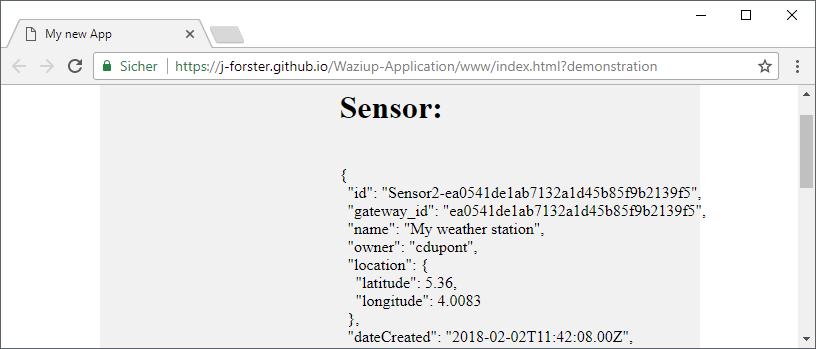
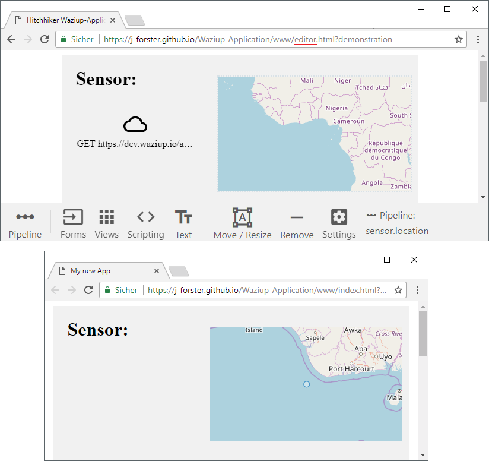
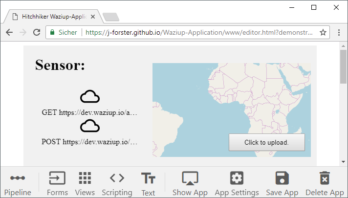

# Fetch

*Fetch* is a control to exchange data with a foreign api server, like [dev.waziup.io](https://dev.waziup.io/docs/).

You can retrieve data from the api server using HTTP GET requests and upload new data with a HTTP POST request, both with a *Fetch* control. But first of all make yourself familiar with the api [documentation](https://dev.waziup.io/docs/) because you will need those api endpoints for the next example application.

### A Sensor Application

Have a look at the [`GET /domains/{domain}/sensors/{sensor_id}`](http://dev.waziup.io/docs/#/Sensors/get_domains__domain__sensors__sensor_id_) request. It's a GET request to gain information from the api server about a specific sensor using its `sensor_id` and `domain`.

Request URL: [`https://dev.waziup.io/api/v1/domains/waziup/sensors/Sensor2-ea0541de1ab7132a1d45b85f9b2139f5`](https://dev.waziup.io:80/api/v1/domains/waziup/sensors/Sensor2-ea0541de1ab7132a1d45b85f9b2139f5)

Response:

```json
{
    "id":"Sensor2-ea0541de1ab7132a1d45b85f9b2139f5",
    "gateway_id":"ea0541de1ab7132a1d45b85f9b2139f5",
    "name":"My weather station",
    "owner":"cdupont",
    "location": {
        "latitude":5.36,
        longitude":4.0083
    },
    "dateCreated":"2018-02-02T11:42:08.00Z",
    "dateModified":"2018-02-02T11:42:08.00Z",
    "domain":"waziup",
    "measurements":[{
        "id":"TC1",
        "name":"My garden temperature",
        "dimension":"temperature",
    "unit":"Degree C",
        "sensor_kind":"Air temperature sensor",
        "values":[{
            "timestamp":"2016-06-08T18:20:27.873Z","value":"25.6"
        }]
    }]
}

```

We use the following **API Fetch** control:

**Method:** GET<br>
**URL:** https://dev.waziup.io/api/v1/domains/waziup/sensors/Sensor2-ea0541de1ab7132a1d45b85f9b2139f5<br>
**Body:** *empty*<br>
**Pipeline:** sensor

A simple text control will display the data recieved, just use `{{sensor}}` as template.


The final application will look like:



Note that the *API Fetch* control ist hidden and fires automatically when the application starts. 

In the previous chapter you learned about the **Map** control and how we can use it for lat/long values. If you combine it with the **API Fetch** you can display any sensor position by connecting their pipelines.

The following Map connects to the `sensor.location` pipeline:





---------------------------------

### Upload Data

Uploading data uses the same techniques as the dowloading example above. We use another *API Fetch* control:

**Method:** POST<br>
**URL:** [https://dev.waziup.io/api/v1/domains/waziup/sensors/Sensor2-ea0541de1ab7132a1d45b85f9b2139f5**/location**](https://dev.waziup.io/api/v1/domains/waziup/sensors/Sensor2-ea0541de1ab7132a1d45b85f9b2139f5/location)<br>
**Body:** sensor.location<br>
**Pipeline:** sensor:click (*sensor* pipeline with event filter *click*)

The upload should be triggered by a button, so grab a button from the *Forms* tab and place it in the apllication. The button connects to the sensors pipeline and triggers a **click** event every time you click the button. The upload **API Fetch** will listen to the *click* event by using the pipeline **sensor:click** (The event filter is separated by a single colon!).

