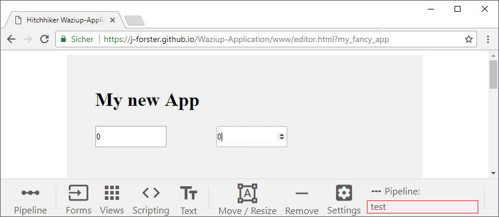
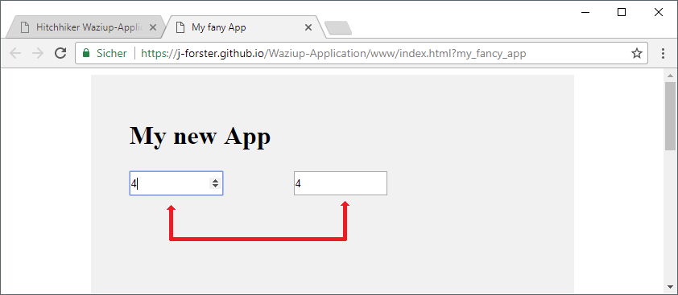
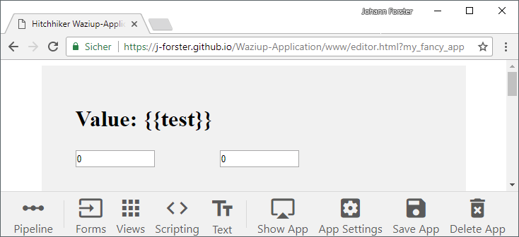

# Piplines

You probably know what a pipeline is. It's pumping stuff from one end to another. And that is exactly the application can do!

Well, it won't pump oil or gas, but it can do pretty well with data.

### Elements and Pipelines

We begin with two **Number** inputs. Click on the **Forms** tab and then on the **Number** control. Place it somewhere on the app surface.
Now grab a second Number control and place it next to the one that you already created.

Click **Save App** and **Show App**. You can change the values independently, but that's not surprising.

We will now to connect the input fields. You can to that by connecting them to a pipeline - the same pipeline for both inputs will make them synchronise.
Think about it as a value transfer: everytime you change a value, it will be pumped through the pipeline and affect all controls that are conencted to it.

Look at the pipeline field: You need a pipeline for **both** inputs. I have choosen a *test* pipeline, but you can use whatever name you want.

Click again on **Save App** and **Show App**. Now the two inputs are connected: Your changes will refelct to the other input and vice versa.
You can also connect more than two elements!

If you want to create a read-only element, just use the headline text element.

Change the text to: `#Value: {{test}}`. It will now listen to the *test* pipeline.

You next step will be to create some more inputs and text elements to fill your application. The next chapter will show you some more pipeline features.

---------------------------------

Next chapter: [▶ Advanced Pipelines](pipeline_advanced.md)